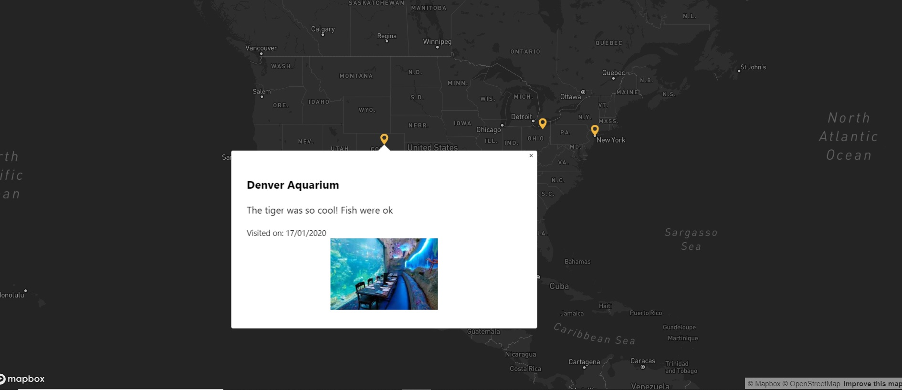
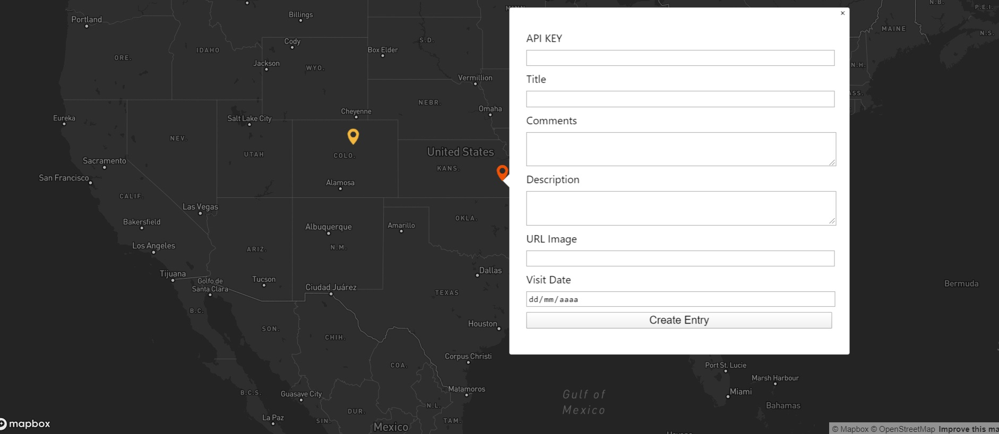

# Travel App

* Application created using NodeJs with ExpressJs and MongoDB on the Backend, and ReactJs and Mapbox on the Frontend.

* This App is a simple web to create a record of a travel, with a title, description, comments, visited date and a URL of an image.

